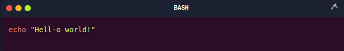

[](https://opensource.org/licenses/MIT)   

# Terminal Snippets Plugin for Obsidian

## Are You a Hacker/Penterster? 

Do you love documenting your hacking methodologies or techniques? Need a sleek way to showcase your terminal commands while keeping your notes clean and organized? Welp, this plugin is for us :D

---




---

## Features

**Supported Terminals:**

- PowerShell (`powershell-session`)
    
- CMD (`cmd-session`)
    
- Bash (`shell-session`)
    
 **Customizable Styles:**

- Choose your own background colors for terminal blocks to match your theme.
    
**Dynamic Updates:**

- Automatically refreshes terminal blocks with updated styles.
    
**Syntax Highlighting:**

- Fully compatible with Prism.js for vibrant, clear code displays.

---

## Setup

1. Navigate into your `.obsidian/plugins` and clone the repository.
```bash
git clone https://github.com/zeroXblivion/Terminal-Snippet
cd Terminal-Snippet
```
2. Enable the plugin in Obsidian's settings under **"Community Plugins"**
3. Enjoy :D
-------
## Usage

Simply add these code blocks to your Markdown files:

````markdown
```powershell-session
Write-Host "Hell-o, PowerShell!"
```
````


````markdown
```cmd-session
Write-Host "Hell-o, CMD!"
```
````

````markdown
```shell-session
Write-Host "Hell-o, Bash!"
```
````

---

## Customize to Your Liking 🎨

1. Open **Terminal Snippets Settings** in Obsidian.
2. Set custom background colors for PowerShell, CMD, and Bash blocks.
3. Enjoy a personalized terminal experience!

---

# Development

- Node.js (v16+ recommended)
- TypeScript
- Esbuild

------

## File Structure

- `main.ts`: Core logic for the plugin.
- `styles.css`: Styling for terminal snippets.
- `manifest.json`: Metadata for the Obsidian plugin.
- `package.json`: NPM configuration.
- `tsconfig.json`: TypeScript compiler settings.

---

## Author

- **0xblivion**
- GitHub: [@zeroXblivion](https://github.com/zeroXblivion)
- Facebook [@0xblivion](https://www.facebook.com/0xblivion/)
